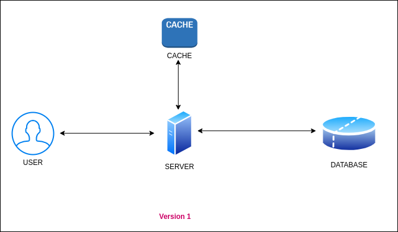
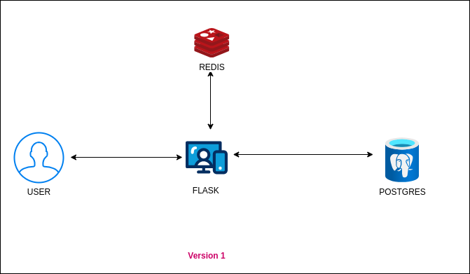
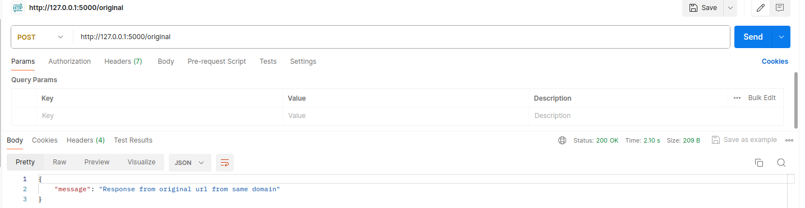
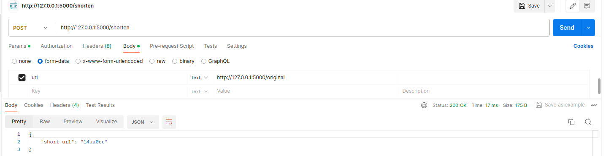
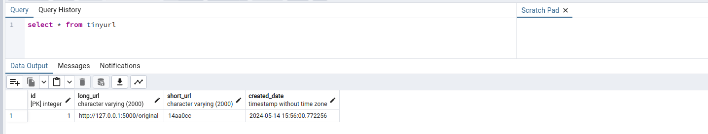
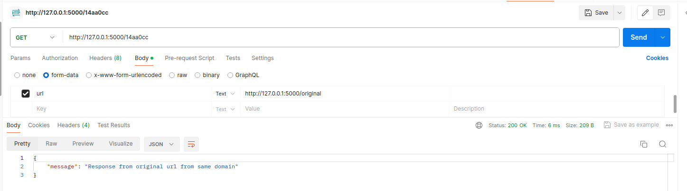
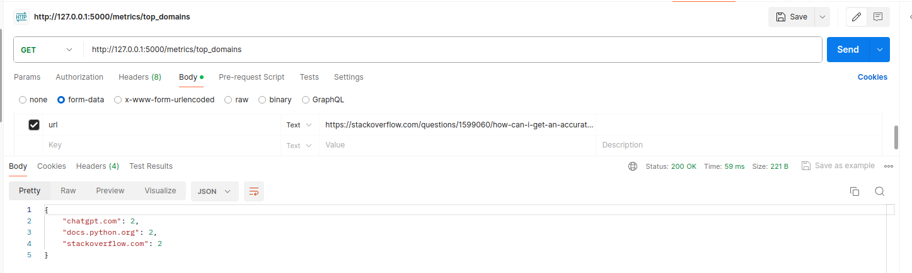
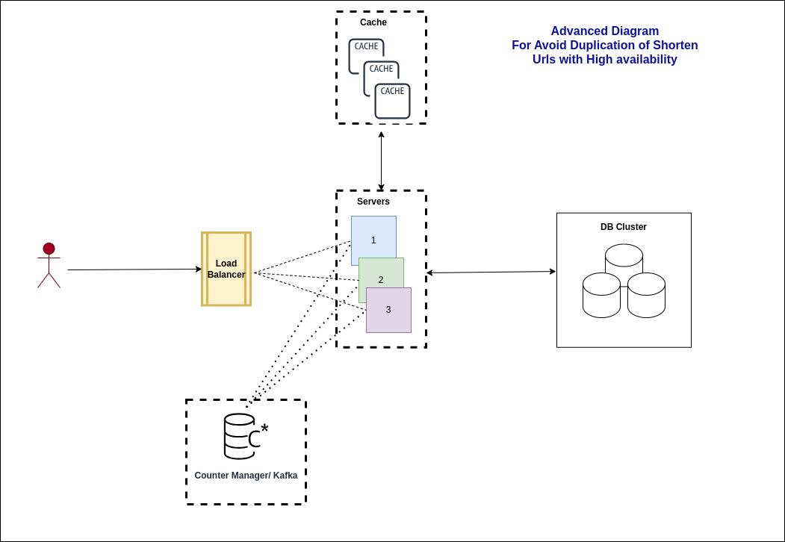

# Problem Statement : 
## *Build a simple URL shortener service that will accept a URL as an argument over a REST API and return a shortened URL as a result.*

1. ####  Introduction to URL Shortening: 
    - URL shorting is techinique to convert long charachters url to short url which helps to save the space and also provide easy way to display it. 

2. Requirements Considerations:
    - If user asks same url again it service should return the same short url instead of generating same again.
    - If the user clicks on the shortURL then he should be redirected to the original URL. Write
    a Redirection API that implements this functionality.
    - The URL and shortened URL should be stored in-memory by application.

4. Data Storage / Calculations:
    - considering some numbers before thinking about data
    - Lets say there are `1000 / user requests per minute`:
        - `1000 * 60(per hour) * 24 (per day) * 30 (per month) * 1  (per year)`  = `43200000  requets per year`
    - Lets say long_url size is max `100 char` :
        - `100 bytes` * `43200000 requers of year` =  `4.32 GB per year`
    - Lets say short_url is `7 char`:
        - `7 bytes` * `43200000 requers of year` = `0.30GB per year`
    - Created Time Size:
        - `8 bytes`  *  `43200000` = `0.34 GB per year` (May add some extra space for storing timezone)

    - So total `4.32 + 0.30 + 0.34` = `4.96 nearly 5GB per year`  
    - *`NOTE: As calculations is in per minute it can be high number if requets goes to per second.`*
    - consider `5GB * 10 year` = `50GB` data to store
    - we can save it in sql or nosql database.

8. Database Schema: 

    - 

    - NOTE: We can consider extra fields like expiry date if wants to delete some data periodically.

    - ##### SQL vs NOSQL Selection:
        - SQL: 
            - Scaling is complex 
            - hard to scale 
            - consistent

        - NOSQL:
            - eventual consistent
            - easy to scale
            - Highly avaialble

3. URL Shortening Algorithm: 
    1. md5 hashing [a-z, 1-9] combinations  (26+10) 36^7 combinations 
        - more data corruption possible as users requets goes higher rate
        - If long_url is same it will generate same short url
        - As we using 7 char can be same for some other urls
        - add extra overhead to check and insert into database
    2. base62: [a-z, A-Z, 1-9] combinations (26+26+10) 62^7 combinations 
        - minimum data corruption possible as users requets goes higher rate
        

5. High Level Design :
    - 
    

6. Low Level Design:
    -  

7. Tech Stack:
    - Flask
    - Docker
    - REDIS
    - POSTGRES

8. Testing Results:
    1. ORIGIONAL_URL
        - Hit the provided URL to observe the response it returns.
        - Note down the response and ensure it matches the expected behavior.
        
        

    2. SHORTEN_API_CALL
        - Hit the provided url to get back shorten url.
        - This will save url with shorten in database
        - Also it will cache it to redis for 15*60 sec so anyone hit within this time user can get back immediately

            

            

    3. SHORTEN_TO_ORIGINAL
        - HIT URL WITH shorten url
        - This will redirect to original one
            
    
    4. TOP_3_DOMAINS:
        - Top 3 mostly visited domains 
        

9. Disadvantages & Future Enhancement:
    1. Currently using `md5` hash which may generate same url again for first 7 digits
    2. We can use counter for each new original url generation which can add uniquness.
    3. When we scale  our system it will be difficult to manage counter at central location so we can use somethin zookeeper to manage the servers and counters centrally.
    4. We can use NoSQL db to scale out the database.
    5. 
   
        
References:
- https://medium.com/@souravgupta14/url-shortener-with-zookeeper-aa38174c598b

