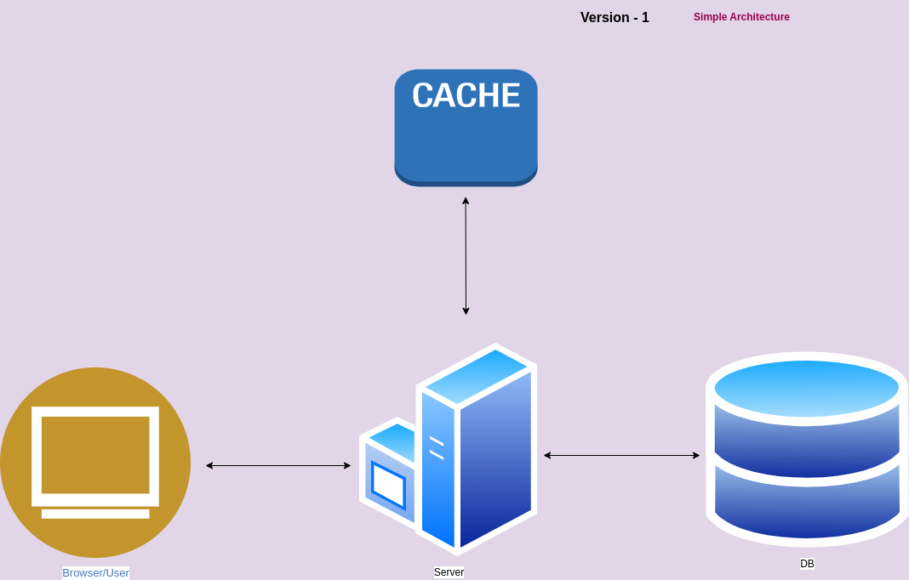

# Problem Statement : 
## *Build a simple URL shortener service that will accept a URL as an argument over a REST API and return a shortened URL as a result.*

### The code should have following features:
1. If I again ask for the same URL,itshould give me the same URL as it gave before instead
of generating a new one.
2. If the user clicks on the shortURL then he should be redirected to the original URL. Write
a Redirection API that implements thisfunctionality.
3. The URL and shortened URL should be stored in-memory by application.

### Architecture :
