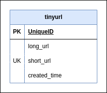

# Problem Statement : 
## *Build a simple URL shortener service that will accept a URL as an argument over a REST API and return a shortened URL as a result.*

1. ####  Introduction to URL Shortening: 
    - URL shorting is techinique to convert long charachters url to short url which helps to save the space and also provide easy way to display it. 

2. Requirements Considerations:
    - If user asks same url again it service should return the same short url instead of generating same again.
    - If the user clicks on the shortURL then he should be redirected to the original URL. Write
    a Redirection API that implements this functionality.
    - The URL and shortened URL should be stored in-memory by application.

4. Data Storage / Calculations:
    - considering some numbers before thinking about data
    - Lets say there are `1000 / user requests per minute`:
        - `1000 * 60(per hour) * 24 (per day) * 30 (per month) * 1  (per year)`  = `43200000  requets per year`
    - Lets say long_url size is max `100 char` :
        - `100 bytes` * `43200000 requers of year` =  `4.32 GB per year`
    - Lets say short_url is `7 char`:
        - `7 bytes` * `43200000 requers of year` = `0.30GB per year`
    - Created Time Size:
        - `8 bytes`  *  `43200000` = `0.34 GB per year` (May add some extra space for storing timezone)

    - So total `4.32 + 0.30 + 0.34` = `4.96 nearly 5GB per year`  
    - *`NOTE: As calculations is in per minute it can be high number if requets goes to per second.`*
    - consider `5GB * 10 year` = `50GB` data to store
    - we can save it in sql or nosql database.

8. Database Schema: 

    - 

    - NOTE: We can consider extra fields like expiry date if wants to delete some data periodically.

3. URL Shortening Algorithm:

5. High Level Design :

6. Low Level Design

7. Tech Stack:

8. Testing Results:

